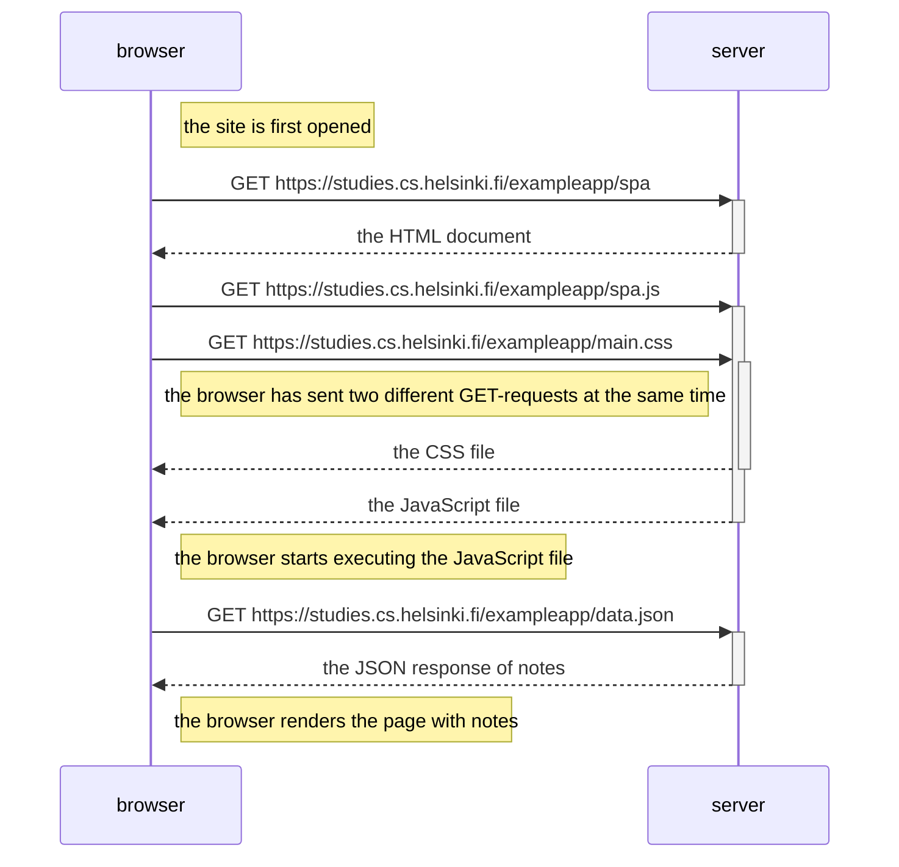

```mermaid
sequenceDiagram;
    participant browser;
    participant server;

    Note right of browser: the site is first opened;
    browser->>+server: GET https://studies.cs.helsinki.fi/exampleapp/spa;
    server-->>-browser: the HTML document;

    browser->>+server: GET https://studies.cs.helsinki.fi/exampleapp/spa.js;
    browser->>+server: GET https://studies.cs.helsinki.fi/exampleapp/main.css;
    Note right of browser: the browser has sent two different GET-requests at the same time;
    server-->>-browser: the CSS file;
    server-->>-browser: the JavaScript file;
    Note right of browser: the browser starts executing the JavaScript file;

    browser->>+server: GET https://studies.cs.helsinki.fi/exampleapp/data.json;
    server-->>-browser: the JSON response of notes;
    Note right of browser: the browser renders the page with notes;
```
